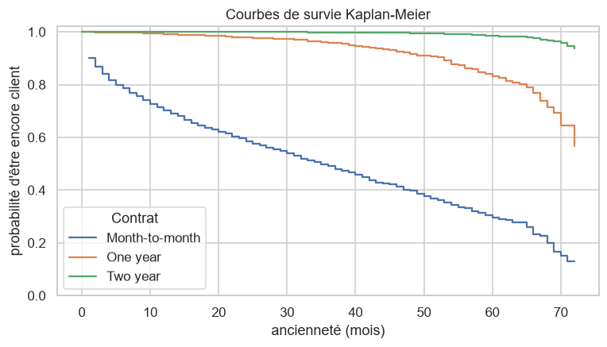
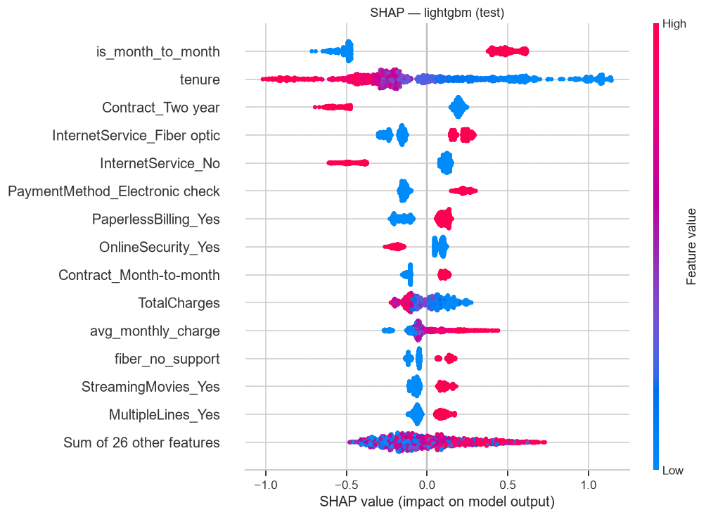
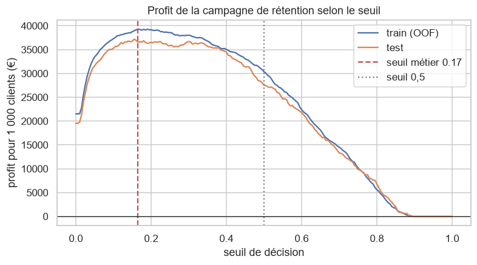

# Prédiction du churn télécom : du modèle à la décision

Prédire quels clients d'un opérateur télécom vont résilier, **décider à qui proposer une offre de
rétention** en arbitrant le coût des faux positifs et des faux négatifs, et exposer le modèle via
une API FastAPI.

> **Résultat clé** : sur le jeu de test (1 409 clients), cibler avec le seuil optimisé pour le
> profit rapporte **51,5 k€**, contre 38,8 k€ avec le seuil par défaut de 0,5 (**+33 %**) et 27,5 k€
> en ciblant tout le monde (**+87 %**), sous les hypothèses détaillées plus bas.

## Données

[Telco Customer Churn (IBM)](https://github.com/IBM/telco-customer-churn-on-icp4d) : 7 043
clients, 19 variables (profil, services souscrits, contrat, facturation) et la cible `Churn`
(26,5 % de churners). Le CSV est téléchargé automatiquement au premier entraînement.

## Démarche

| Étape | Notebook | Ce qu'on y apprend |
|---|---|---|
| Analyse exploratoire | [01_eda](notebooks/01_eda.ipynb) | χ² + V de Cramér avec correction de Holm, Mann-Whitney, VIF, courbes de survie Kaplan-Meier + log-rank |
| Ingénierie des variables | [02_feature_engineering](notebooks/02_feature_engineering.ipynb) | variables métier dans un transformer sklearn (sans fuite), information mutuelle, ablation testée statistiquement |
| Modélisation | [03_modeling](notebooks/03_modeling.ipynb) | LogReg / XGBoost / LightGBM tunés par Optuna, Wilcoxon et McNemar, IC bootstrap, calibration, SHAP |
| Impact métier | [04_business_impact](notebooks/04_business_impact.ipynb) | courbe de profit, seuil optimal, lift, sensibilité aux hypothèses, recommandations |

### Ce qui influence le churn



Les clients **sans engagement** partent massivement dans leurs premiers mois. Facteurs les plus
liés au churn (V de Cramér) : type de contrat, absence de sécurité en ligne ou de support
technique, fibre optique, paiement par chèque électronique. Le genre n'a aucun effet mesurable.

### Modèles

Validation croisée stratifiée à 5 plis sur le train (80 %), 50 essais Optuna par modèle, objectif
PR-AUC (la classe positive est minoritaire).

| Modèle | PR-AUC (CV) | ROC-AUC (CV) | Brier (CV) |
|---|---|---|---|
| Naïf (classe majoritaire) | 0,265 | 0,500 | 0,195 |
| Régression logistique | 0,662 | 0,847 | 0,135 |
| XGBoost | 0,667 | 0,848 | 0,134 |
| **LightGBM** (retenu) | **0,668** | **0,849** | **0,134** |

**Test final** (LightGBM calibré) : ROC-AUC **0,848** [IC95 0,826–0,868], PR-AUC **0,668**
[0,619–0,718].

Les écarts entre les trois modèles **ne sont pas statistiquement significatifs** (Wilcoxon sur les
plis : p ≥ 0,31 ; McNemar sur le test : p ≥ 0,21). LightGBM est retenu pour son score moyen, mais
la régression logistique serait un choix tout aussi défendable si l'interprétabilité primait. Les
deux familles s'appuient sur les mêmes signaux (SHAP).



### Du score à la décision

Hypothèses (modifiables dans [config.py](src/churn/config.py)) : valeur client = 12 mois de
facture, offre de rétention à 50 €, 30 % des churners ciblés restent.

| | Client ciblé | Client non ciblé |
|---|---|---|
| **Va partir** | `0,3 × valeur − 50 €` | valeur perdue |
| **Va rester** | `− 50 €` | 0 |

Un faux positif coûte bien moins qu'un churner non détecté : le seuil optimal est **0,165**, et
non 0,5. Il est choisi sur les prédictions *out-of-fold* du train, jamais sur le test.



| Stratégie (test, 1 409 clients) | Clients ciblés | Churners captés | Profit |
|---|---|---|---|
| Aucune action | 0 | 0 | 0 € |
| Cibler tout le monde | 1 409 | 374 | 27 524 € |
| Modèle, seuil 0,5 | 293 | 191 | 38 808 € |
| **Modèle, seuil métier** | **721** | **329** | **51 527 €** |
| Oracle (plafond théorique) | 374 | 374 | 79 274 € |

L'analyse de sensibilité (notebook 04) montre que le seuil optimal varie de 0,05 à 0,88 selon le
coût de l'offre et le taux d'acceptation. C'est pourquoi l'API renvoie la probabilité calibrée et
le gain espéré, pas seulement une décision oui/non.

## API

```
GET  /health          état du service
GET  /model/info      modèle, seuil, hypothèses, hyperparamètres
POST /predict         un client : probabilité, décision, gain espéré, 3 facteurs SHAP
POST /predict/batch   jusqu'à 1 000 clients (?explain=true pour les facteurs)
```

Exemple de réponse de `/predict` :

```json
{
  "churn_probability": 0.7776,
  "will_churn": true,
  "threshold": 0.165,
  "recommended_action": "retention_offer",
  "expected_gain_if_targeted": 189.35,
  "top_factors": [
    {"feature": "is_month_to_month = 1", "impact": 0.6135, "effect": "augmente le risque"},
    {"feature": "tenure = 3", "impact": 0.579, "effect": "augmente le risque"},
    {"feature": "InternetService=Fiber optic", "impact": 0.2325, "effect": "augmente le risque"}
  ]
}
```

Les entrées sont validées strictement par Pydantic (modalités autorisées, bornes, champs inconnus
refusés → 422). La documentation interactive est disponible sur `/docs`.

## Lancer le projet

```bash
python -m venv .venv
.venv/Scripts/activate          # Linux/macOS : source .venv/bin/activate
pip install -e ".[dev]"

python -m churn.train --trials 50   # télécharge les données, tune, calibre, sauvegarde models/
pytest                              # 27 tests, sans besoin du CSV (données synthétiques)
uvicorn churn.api.main:app --reload # http://localhost:8000/docs
```

Pour exécuter les notebooks avec l'environnement du projet :

```bash
python -m ipykernel install --sys-prefix --name churn --display-name "Python (churn)"
```

Avec Docker (le modèle doit avoir été entraîné) :

```bash
docker build -t churn-api .
docker run -p 8000:8000 churn-api
```

## Structure

```
src/churn/
  config.py      chemins, graine, hypothèses métier
  data.py        téléchargement, nettoyage, split stratifié
  features.py    FeatureEngineer (transformer sklearn) + préprocesseur
  models.py      pipelines et espaces de recherche Optuna
  evaluate.py    métriques, profit, seuil optimal, lift, tests statistiques
  train.py       entraînement de bout en bout (CLI)
  predict.py     inférence + explications SHAP
  api/           FastAPI + schémas Pydantic
tests/           données, features, fonctions métier, API
notebooks/       01 à 04
models/          modèle joblib + metadata.json (métriques, seuil, hyperparamètres)
```

## Limites

- **Données** : jeu IBM semi-synthétique, instantané sans dimension temporelle. En production, il
  faudrait construire les variables à une date de référence et valider sur une période future.
- **Hypothèses de coût** : illustratives. À calibrer avec les équipes marketing et finance.
- **Churn ≠ effet de l'offre** : le modèle prédit qui va partir, pas qui restera *grâce à* l'offre.
  L'étape suivante serait un test A/B puis un modèle d'*uplift*.
- **Équité** : `gender` et `SeniorCitizen` sont des variables sensibles. Le genre n'a pas d'effet
  ici, mais leur usage doit être validé avant tout déploiement.
